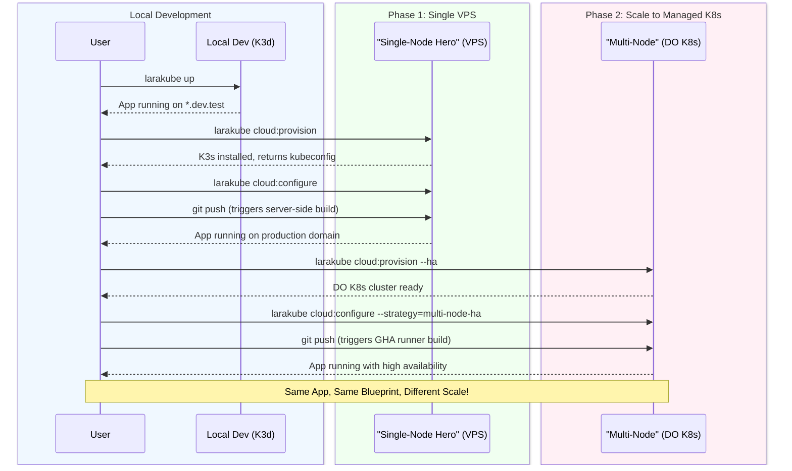

# 🚀 The Scaling Roadmap

This document visualizes the journey of a LaraKube user, from local development on their laptop to a cost-effective single VPS, and finally to a high-availability, multi-node managed Kubernetes cluster.

The core principle is **"Same Blueprint, Different Scale."** The application code and the `.larakube.json` blueprint remain identical at every stage. Only the deployment `strategy` changes.

## The Visualized Journey

## Stage Explanations

### 1. Local Development
-   **Environment**: A local K3d cluster managed by the `larakube` CLI.
-   **Cost**: Free.
-   **Goal**: Achieve perfect production parity on your laptop for bug-free development.

### 2. Single-Node Hero
-   **Environment**: A single, cost-effective VPS (starting ~$4-12/mo) running K3s.
-   **Deployment**: Uses the ultra-fast **server-side build cache**. The GHA runner simply tells the server to `git pull` and build itself.
-   **Goal**: Launch a production-ready application with minimal cost, rivaling Docker Swarm setups in price but with the power of K8s.

### 3. Multi-Node High Availability
-   **Environment**: A managed Kubernetes service like DigitalOcean Kubernetes (DOKS).
-   **Deployment**: The deployment `strategy` is switched to `multi-node-ha`. The GHA runner now builds the image itself and triggers a rolling update on the managed cluster.
-   **Goal**: Scale the application to handle enterprise-level traffic with redundancy and zero-downtime deployments, without changing a single line of application code.
