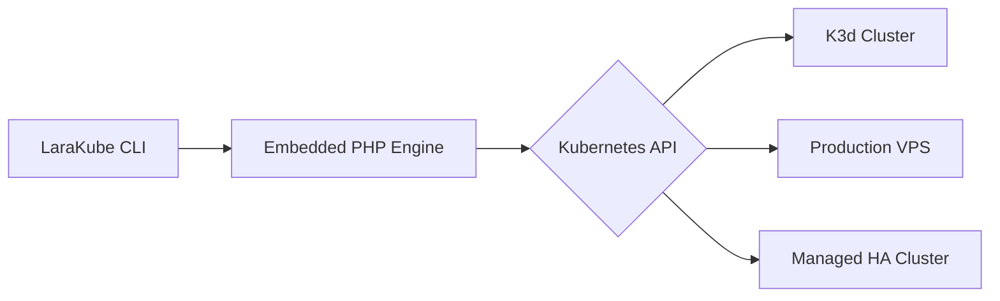

# Core Philosophy

LaraKube is built on a **Container-First** philosophy. We believe that a developer's host machine should be kept as clean and "factory-original" as possible.

## ⚙️ The Orchestration Engine
LaraKube's "No-Host-Dependency" model works by abstracting Kubernetes into a standalone binary:

## 🚀 Zero-Host Dependency
LaraKube assumes you don't have PHP, Composer, or Node installed on your Mac or Linux machine.
- **Isolated Creation:** When you run `larakube new`, the CLI pulls a specialized installer image to build your app.
- **Isolated Maintenance:** Tasks like installing dependencies (`composer install`, `npm install`) happen inside ephemeral containers, not on your host.
- **Consistency:** By using containers for everything, we guarantee that "it works on my machine" means "it works on everyone's machine."

## 🔐 Identity & Permissions (UID/GID)
One of the biggest pain points of mounting local folders into containers on Linux is file ownership (files being created as `root`).
- **Automatic Mapping:** LaraKube automatically detects your host's **User ID** and **Group ID**.
- **Transparent Ownership:** It maps these IDs into the running Kubernetes pods. Any file generated by Laravel (like logs or compiled views) is owned by **you** on your host machine, making it easy to edit or delete without `sudo`.

## 🧠 Stateless CLI & Stateful Console
LaraKube separates "Orchestration" (doing things) from "Management" (remembering things).
- **Stateless CLI:** The `larakube` binary is a pure execution engine. It doesn't hold project history, audit logs, or global settings. It operates strictly on the files in your current working directory.
- **Stateful Console:** The **LaraKube Console** is the central authority. It maintains the project registry, stores every operational log, and acts as the "long-term memory" for both human developers and AI agents.

This separation ensures the CLI remains extremely fast and portable, while the Console provides the data density required for professional fleet management.
