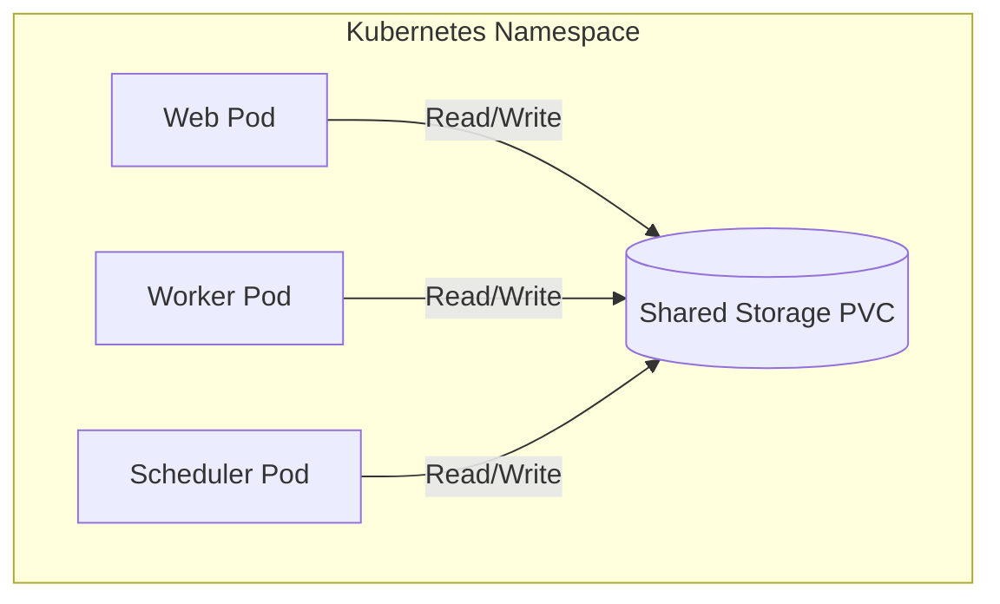

# Shared Storage & Workload Parity

In a traditional Kubernetes setup, different workloads (Web, Workers, Scheduler) often have isolated filesystems. This leads to common issues in Laravel applications, such as a sitemap generated by the Scheduler not being visible to the Web server, or temporary files from a job being inaccessible to other workers.

LaraKube solves this by implementing a **Unified Shared Storage** architecture.



## 🏗 The Unified Volume Model
Instead of separate Persistent Volume Claims (PVCs) for each service, LaraKube uses a single, high-performance PVC that is shared across all Laravel-related pods in your project namespace.

### 📁 What is shared?

The following directories are mounted from the shared volume into every pod (`web`, `horizon`, `scheduler`, `reverb`, etc.):

- **`storage/`**: All application logs, file uploads, and framework-managed data.
- **`bootstrap/cache/`**: Shared framework optimization files. This ensures that when the Web pod runs `artisan optimize`, all workers immediately benefit from the cached configuration.
- **`app/public/`**: Assets that are generated dynamically (like sitemaps, QR codes, or processed images) are immediately available to the web server.

## 🔄 Workload Parity

This architecture ensures "Workload Parity"—the guarantee that all parts of your application see the exact same filesystem state at all times.

| Feature | Without Shared Storage | With LaraKube Shared Storage |
| :--- | :--- | :--- |
| **Sitemaps** | Hidden in the Scheduler pod. | Instantly served by the Web pod. |
| **Log Tailing** | Must check individual pods. | Centralized in the shared volume. |
| **Config Cache** | Can get out of sync. | Unified in `bootstrap/cache`. |
| **File Uploads** | Requires external S3. | Works seamlessly with local storage. |

:::note This is the single-node picture
The table above describes one node where every pod shares a single volume — the default on a single-node VPS. At multi-node scale a block volume **can't** span nodes, so the model changes. See [Storage across the scaling journey](#-storage-across-the-scaling-journey) below: externalize by default, opt in to a shared filesystem only when an app truly needs one.
:::

## 🗺 Storage across the scaling journey

How the shared volume behaves depends on **where** you run. On a single node it's automatic; at multi-node scale you choose between externalizing state (recommended) and an opt-in shared filesystem.

### 1. Single-node (the $6–12 VPS) — shared by default
On a **Single-Node Hero**, every pod lands on the same node, so LaraKube mounts one `ReadWriteOnce` (RWO) PVC and shares it across `web`, `horizon`, `scheduler`, and friends. You get full Workload Parity for free, at native disk speed, with no object storage required. This is the default and the sweet spot for most apps.

### 2. Multi-node (HA) — externalize state (recommended)
When you graduate to a **multi-node managed cluster** (`multi-node-ha`), block storage (`do-block-storage`, EBS, …) is `ReadWriteOnce` — it physically cannot span nodes. So LaraKube runs the app pods **stateless**: each gets a per-pod `emptyDir` (no shared PVC) and is free to schedule on any node.

State then lives outside the pods:

- **Uploads / `app/public`** → object storage (DO Spaces, S3, or a Plex Commons running MinIO/SeaweedFS).
- **Sessions / cache** → Redis or the database.

`cloud:deploy` warns if anything is still pointed at local storage. A [Plex Commons](../deployment/multiple-projects#going-further-plex) provides the S3 + Redis backends out of the box. SQLite stays single-node by nature (its DB is a file).

> **Why externalize instead of a shared disk?** It's the only path that's genuinely HA — no shared-storage single point of failure, pods reschedule anywhere, and it's how managed platforms expect Laravel to scale.

### 3. Multi-node with a real shared folder — opt-in NFS (experimental)
Some apps genuinely need a shared cross-node filesystem — e.g. a worker writes `public/storage/sitemap.xml` and the web pod serves it, and rewriting that to S3 isn't worth it. For those, opt in per environment:

```bash
larakube cloud:provision:nfs          # installs an in-cluster NFS provisioner → larakube-nfs StorageClass
# then set "sharedStorage": true on the env, and redeploy
```

LaraKube stands up a single NFS server (a block volume re-exported as `ReadWriteMany`) and points the shared PVC at it, so your shared folder works across nodes unchanged.

:::warning Experimental — and a soft SPOF
The NFS server is a single pod: a **storage** single point of failure (your app pods stay HA, but if that pod restarts, shared I/O pauses). It also relies on the node's NFS mount path, which **does not work on DigitalOcean Kubernetes (DOKS)** — the mount hangs. Treat this as an escape hatch for apps that can't externalize; prefer option 2 wherever you can.
:::

### 4. Truly-HA shared filesystem — advanced (roadmap)
A production-grade `ReadWriteMany` without the single-pod SPOF needs a distributed filesystem — **CephFS / Longhorn / `csi-driver-nfs`** or a managed filer. LaraKube doesn't wire these up yet; it's a tracked [roadmap](../community/roadmap) item for teams that need both a shared folder *and* high availability.

### 💻 Local development
Local provisioners usually only support `ReadWriteOnce` (RWO). To maintain parity, LaraKube uses a **Surgical Kustomize Patch** (`overlays/local/pvc-patch.yaml`) that pins PVCs to RWO. Since your local cluster is a single node, multiple pods still mount the same RWO volume simultaneously — exactly like the single-node production path.
