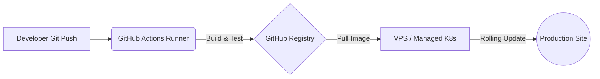

# 🚀 CI/CD with GitHub Actions (Cloud Pilot)

LaraKube's **Cloud Pilot** is a GitOps workflow that builds, pushes, and deploys your app on every `git push` — designed to run cleanly even on a $6/mo 1GB VPS without out-of-memory crashes. Every project is pre-scaffolded with a production-grade workflow.



## ⚡️ The automated pipeline
When you push to your deploy branch, the workflow:

1. **Frontend build** — a Node.js stage installs dependencies and compiles your assets with Vite.
2. **Multi-stage PHP build** — the compiled assets are copied into a fresh PHP image, so your production image is self-contained (no Node.js overhead).
3. **GHCR publication** — the image is pushed to the **GitHub Container Registry**.
4. **Cluster deployment** — the new version rolls out to your cluster with zero downtime.

## 🧠 The "secret sauce": build offloading
Running `composer install` or `npm run build` directly on a 1GB droplet will crash it under load. Cloud Pilot offloads the heavy lifting:

1. **Heavy work on GitHub runners** — Composer, NPM, and Docker image builds all happen on GitHub's runners, not your server.
2. **Zero-OOM guarantee** — your VPS stays cool and responsive, acting only as the *runtime*.
3. **Registry-first** — the built image is pushed to GHCR and simply *pulled* by your VPS — an extremely light operation.

## 🛠 Setting it up
The one-time setup generates the workflow and wires up your secrets:

```bash
larakube cloud:configure gha
```

This generates a hardened workflow at `.github/workflows/larakube-deploy-{env}.yml`, securely extracts minified cluster credentials, and configures the `ghcr-login` pull secret on your remote cluster. Under the hood it calls `gha:configure` for the secret upload — you can run that step on its own for a specific environment:

```bash
larakube gha:configure production
```

- Uses an isolated GitHub CLI container (no local `gh` install needed).
- Uploads your `.env.production` and current `KUBECONFIG` as GitHub Secrets.
- Sets up registry authentication for your cluster.

### Related `gha:*` commands
- `larakube gha:login` — authenticate with GitHub via the official CLI (once per machine).
- `larakube gha:user` — print the currently authenticated GitHub user (verify which account `gha:configure` will target).
- `larakube gha:switch` — switch between authenticated GitHub accounts (personal/work).

All `gha:*` commands run inside the same isolated GitHub CLI container — no local `gh` install required.

## 🛡 Security standards

**Literal secret injection.** Your environment variables are injected straight into the Kubernetes Secret during the GitHub Actions run — they never touch your Git repository in plain text, and they don't leak into logs.

**Surgical context extraction.** The `KUBECONFIG` secret uploaded to GitHub is **minified** — it contains only the certificate and token for that specific environment. Your local development contexts (like `k3d-larakube`) are never uploaded.

### Secrets LaraKube manages for you
- `{ENV}_KUBECONFIG` — the minified credentials for that environment's cluster.
- `{ENV}_ENV_FILE_BASE64` — your production-ready environment variables.

## 🏁 The push-to-deploy experience
Once configured, deploying is just:

1. **Commit** your changes.
2. **Push** to your deploy branch (e.g. `git push origin main`).
3. **Monitor** progress in your GitHub Actions tab.
4. **Relax** — LaraKube performs a rolling, zero-downtime update on your cluster.

## Manual deployments
Need to push a quick update without a Git push? Deploy from your terminal:

```bash
larakube cloud:deploy production
```

:::note Renamed in v0.3.0
This command was previously `larakube deploy production`. It was renamed to `larakube cloud:deploy` to consolidate all cloud/production commands under one namespace (see [Cloud Deployment](../commands/cloud)).
:::
