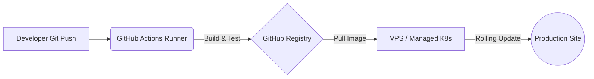

# 🚀 Cloud Pilot: The GitOps Workflow

LaraKube's "Cloud Pilot" is an industrial-strength GitOps workflow designed to run seamlessly on our $6/mo baseline VPS (1GB RAM) without OOM crashes.



## ⚙️ The "Secret Sauce": Build Offloading
Running CPU-intensive tasks like `composer install` or `npm run build` directly on a 1GB droplet will cause it to crash under load. LaraKube solves this by offloading the heavy lifting:

1.  **GHA Build Engine**: All heavy lifting (Composer dependencies, NPM builds, Docker image creation) happens on **GitHub Runners**.
2.  **Zero-OOM Guarantee**: Your VPS remains cool and responsive, acting only as the *runtime* environment for your application.
3.  **Registry-First**: Images are securely pushed to the **GitHub Container Registry (GHCR)** and simply "pulled" by your VPS, which is an extremely light, low-memory operation.

## 🛠 Configuration Lifecycle
Setting up the Cloud Pilot is a one-time operation:

```bash
larakube cloud:configure gha
```

### What happens under the hood?
- **Automated Security**: It generates a hardened workflow, securely extracts minified cluster credentials, and configures the `ghcr-login` secret on your remote VPS.
- **Push-to-Deploy**: Once configured, you simply run `git push`. GitHub builds your "Lambo" and your VPS performs a zero-downtime rolling update.

## 🛡 Security Standards

### 1. Literal Secret Injection
Unlike traditional deployments that might leak secrets into logs, LaraKube uses a **Literal Injection** strategy. Your environment variables are securely injected into the Kubernetes Secret manifest during the GHA run, ensuring they never touch your Git repository in plain text.

### 2. Surgical Context Extraction
The `KUBECONFIG` secret uploaded to GitHub is **Minified**. This means it only contains the certificate and token required for that specific environment. Your local development contexts (like `k3d-larakube`) are never leaked to the cloud.

## 📋 Required Secrets
When you run `cloud:configure gha`, LaraKube manages these for you:
-   `{ENV}_KUBECONFIG`: The minified credentials for your cluster.
-   `{ENV}_ENV_FILE_BASE64`: Your production-ready environment variables.

## 🏁 The "Push-to-Deploy" Experience
Once configured, your deployment workflow is simple:
1.  **Commit** your changes.
2.  **Push** to your main branch (e.g., `git push origin main`).
3.  **Monitor** the progress in your GitHub Actions tab.
4.  **Relax** while LaraKube performs a rolling, zero-downtime update on your cluster.
