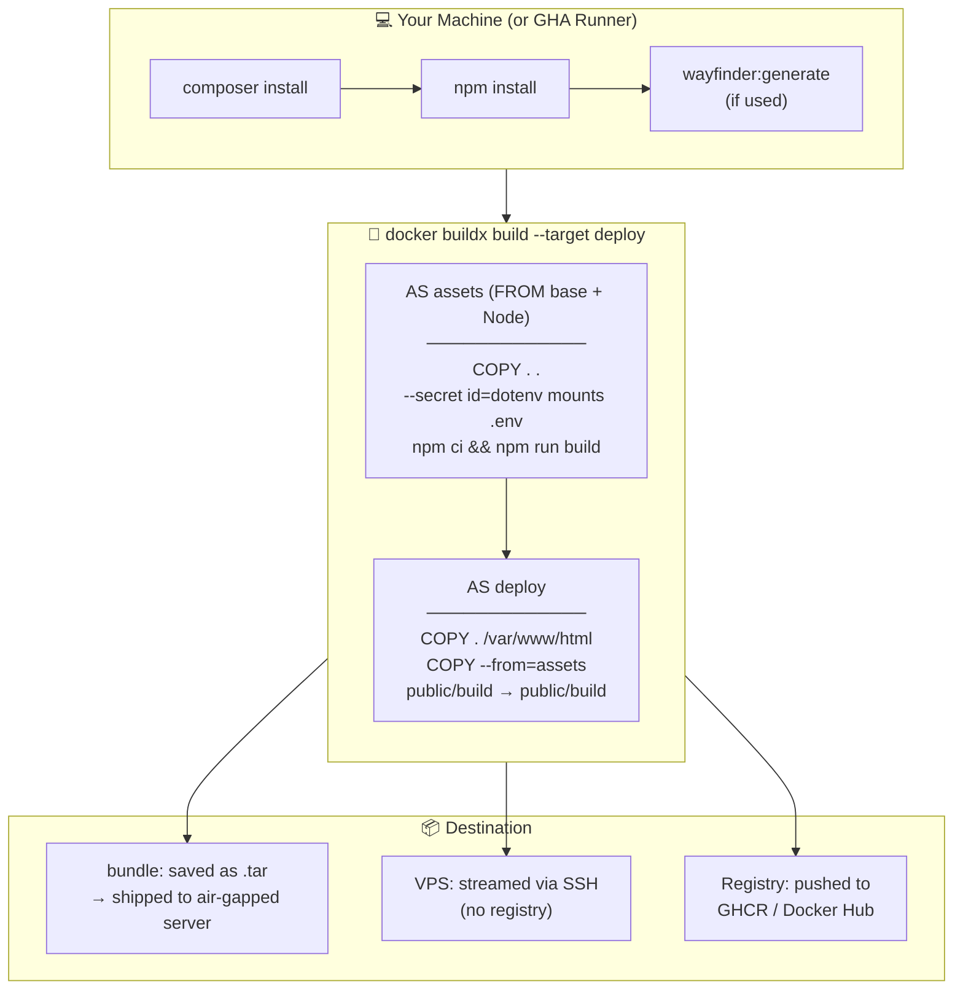

# How Builds Work

LaraKube CLI offers three production deploy paths. They share the same **pre-build steps** (Composer, Node, Wayfinder) but differ in *where* the Docker image is built, *where* `npm run build` happens, and *where* VITE environment variables come from.

---

## The Three Paths at a Glance

| Step | `bundle:build` + `bundle:install` | `cloud:deploy` (manual) | GitHub Actions |
|---|---|---|---|
| `composer install` | host (via dev pod) | host (via dev pod) | GHA runner |
| `npm install` | host (via dev pod) | host (via dev pod) | GHA runner |
| `wayfinder:generate` | host (via dev pod) | host (via dev pod) | GHA runner |
| **`npm run build`** | **Docker `assets` stage** | **Docker `assets` stage** | **Docker `assets` stage** |
| VITE vars source | `.env.{env}` + `.larakube.json` (mounted as BuildKit secret) | `.env.{env}` + `.larakube.json` (mounted as BuildKit secret) | `.env` (decoded from GHA secret, VITE_* appended) |
| Image destination | saved to `.tar` in bundle | SSH side-load **or** registry push | registry push (GHCR / Docker Hub) |
| `kubectl apply` | on the air-gapped server | from your machine | from the GHA runner |

The most important row is **`npm run build`**. In all three paths it runs *inside Docker* — never on the developer's machine. That means:

- Your local `public/build/` is never overwritten by a deploy.
- The correct per-environment hostname (e.g. `https://staging.myapp.com`) is always baked in, not whatever happens to be in your local `.env`.

---

## The Build Pipeline in Detail



---

## Why `npm run build` Is Inside Docker

Vite bakes `VITE_*` environment variables into the compiled JS at build time. They cannot be changed at runtime. If `npm run build` runs on your machine:

- It reads your **local `.env`** — which has dev values like `localhost` or `.kube` hostnames.
- Those wrong values get frozen into the image and shipped to production.

By moving the build into Docker, LaraKube CLI mounts your `.env.{environment}` file as a **BuildKit secret** (`--secret id=dotenv,src=.env.staging`). Vite reads it at build time to get the correct `VITE_*` values. The secret is never baked into any image layer — not in the `assets` stage, not in `deploy`.

LaraKube CLI appends the VITE_* values it derives from your `.larakube.json` config (the hostnames you set when running `larakube env production` or `larakube env airgap --offline`) to the secret before the build, so you never have to add them manually to your `.env` files.

---

## Wayfinder and PHP in the Assets Stage

[Wayfinder](https://github.com/laravel/wayfinder) generates TypeScript route definitions from your PHP routes via `php artisan wayfinder:generate`. The `@laravel/vite-plugin-wayfinder` Vite plugin also re-calls this command during every `npm run build`.

Because the `assets` stage is built `FROM base` (the same PHP image your app uses), **PHP is available** — Wayfinder's Vite plugin works without any workarounds. The pre-deploy step on the host still runs `wayfinder:generate` first; the Docker stage may re-run it cleanly as part of the Vite build.

---

## REVERB_APP_KEY for Air-Gapped Bundles

For bundle builds with Reverb, `REVERB_APP_KEY` must be known at **build time** (so it can be baked as `VITE_REVERB_APP_KEY`) and at **install time** (so the server's Reverb config matches). LaraKube CLI handles this automatically:

1. `bundle:build` generates a random `REVERB_APP_KEY` and stores it in `bundle.json`.
2. The key is written into the BuildKit secret (the augmented `.env.{environment}` file) so Vite bakes `VITE_REVERB_APP_KEY` into the compiled JS without exposing it in any image layer.
3. `bundle:install` reads the key from `bundle.json` and uses it when writing the Kubernetes secrets — so the baked JS and the runtime server are always in sync.

For `cloud:deploy` and GitHub Actions, `REVERB_APP_KEY` comes from your `.env` / GHA secrets and is injected at deploy time.

---

## Keeping Your Dockerfile Up to Date

The `assets` stage was introduced in v0.18.41. If your project was scaffolded before that version, run:

```bash
larakube heal
```

This regenerates `Dockerfile.php` with the new stage. Your existing `cloud:deploy` and `bundle:build` will pick it up on the next run.
