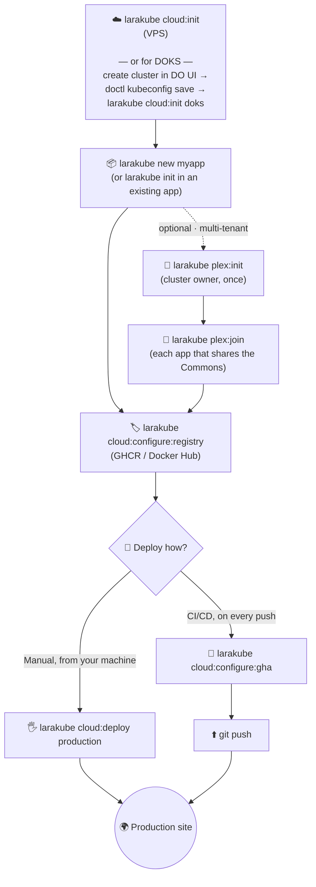

# 🗺 The Deployment Journey

Every LaraKube CLI deployment follows the **same spine**. Only the *very last* step forks into two paths (manual vs CI/CD). This page is the map — bookmark it when you forget the order.

## The phases

### 1 · Cluster — *once per cluster*
Stand up the place your apps will run, and get its admin context onto your machine.

- **VPS / Droplet:** `larakube cloud:init` — installs K3s, **hardens the box** (UFW, fail2ban, key-only SSH), syncs the admin kubeconfig as `larakube-<ip>`, and deploys Traefik.
- **DOKS (managed):** create the cluster in the DigitalOcean UI → `doctl kubernetes cluster kubeconfig save <name>` → `larakube cloud:init doks` (installs Traefik, returns the LoadBalancer IP). See the [DOKS quickstart](./doks-quickstart).

> Already provisioned and just want to re-apply firewall/SSH hardening? `larakube cloud:harden <env>`.

### 2 · Project — *once per app*
- `larakube new myapp` — scaffold a fresh project, **or**
- `larakube init` — adopt an existing Laravel app.

Both write a `.larakube.json` blueprint and generate your Kubernetes manifests.

### 3 · Shared services — *optional, multi-tenant only*
If several apps should share one set of backing services (a Plex **Commons**):

- **Cluster owner, once:** `larakube plex:init` — provisions the shared Commons (Postgres/Redis/object-storage) on the cluster.
- **Each app:** `larakube plex:join` — allocates this app's database / Redis index / bucket from the Commons and writes the connection into its `.env`.

Skip this entirely and each app just deploys its **own** Postgres/Redis pods. See [Multiple projects](./multiple-projects).

### 4 · Target + registry
- Set the env's **web host** (e.g. `app.example.com`) — `cloud:deploy` will also prompt for it if missing.
- `larakube cloud:configure:registry` — pick **GHCR** or **Docker Hub**. Required for the CI/CD path; optional for manual VPS deploys (those can side-load the image over SSH instead).

### 5 · Deploy — **the fork** 👇
This is the only step that differs:

| | 🖐 [Manual — `cloud:deploy`](./manual-deploy) | 🤖 [CI/CD — GitHub Actions](./github-actions) |
|---|---|---|
| **Best for** | solo dev, quick iterations, learning | teams, repeatable production releases |
| **Trigger** | run the command from your machine | `git push` to your deploy branch |
| **Where it builds** | on your machine | on GitHub's runners (spares a 1GB VPS) |
| **Registry** | optional (VPS side-load) · required for multi-node | required (GHCR / Docker Hub) |
| **One-time setup** | none beyond provisioning | `cloud:configure:gha` + secrets |
| **Re-deploy** | re-run `cloud:deploy` | `git push` |

Pick the path that fits and follow its page — they share everything above, so you only ever learn step 5 twice.
