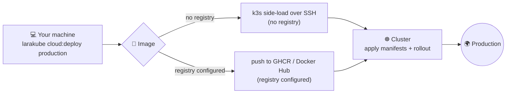

# 🖐 Manual Deploy — `cloud:deploy`

The manual path deploys **straight from your machine** to a cluster — no CI/CD, no `git push`. It's the fastest way to ship while you're iterating, learning, or running solo.

> Prefer automated deploys on every push? Use the [GitHub Actions path](./github-actions) instead. Not sure? Start at [The Deployment Journey](./journey).



## When to use it
- ✅ Solo developer or a quick test deploy.
- ✅ A single-node VPS where side-loading the image over SSH is simplest.
- ✅ You want to deploy *right now* without setting up secrets and workflows.

For team workflows and repeatable production releases, prefer [CI/CD](./github-actions).

## Prerequisites
- A provisioned cluster (see [The Deployment Journey](./journey)) with its `larakube-<ip>` context on your machine.
- A project (`larakube new` / `larakube init`).
- A web host for the environment (the command prompts for one if it's missing).

## Step 1 — (optional) choose a registry
On a **single-node VPS**, you can skip this — `cloud:deploy` will side-load the image straight into the node's k3s over SSH, no registry needed.

On a **multi-node** cluster (e.g. DOKS), every node must be able to pull the image, so configure a registry:

```bash
larakube cloud:configure --only=registry      # pick GHCR or Docker Hub
```

## Step 2 — deploy
```bash
larakube cloud:deploy production
```

What it does, in order:

1. **Builds** the production image for the node's architecture (`linux/amd64`).
2. **Ships the image** — side-loads over SSH (no registry) **or** pushes to your configured registry.
3. **Grants a namespace-scoped credential** — using your local admin context, it creates a `deployer` ServiceAccount + Role + RoleBinding locked to this app's `{app}-{env}` namespace.
4. **Applies** your manifests (ConfigMap/Secret from `.env.{env}`, then the overlay) **through that scoped credential** — so the deploy itself runs with least privilege.
5. **Waits** for the rollout to finish.

Re-deploying is just running the command again.

## 🔒 What "namespace-scoped" means
Your **admin** kubeconfig never leaves your machine. The actual apply runs as the `deployer` ServiceAccount, which can only touch its own namespace. You can prove it after a deploy:

```bash
# yes inside its own namespace…
kubectl --context larakube-<ip> auth can-i create deployments -n myapp-production \
  --as=system:serviceaccount:myapp-production:deployer        # → yes

# …no anywhere else
kubectl --context larakube-<ip> auth can-i get secrets -n default \
  --as=system:serviceaccount:myapp-production:deployer        # → no
```

This is the same credential model the CI path will hand to GitHub — see [Surgical Credentials](./surgical-credentials).

## Verify
```bash
kubectl --context larakube-<ip> get pods -n myapp-production
kubectl --context larakube-<ip> logs -n myapp-production deployment/web -f
```

Then open your web host in a browser.

## Troubleshooting
- **`kubectl apply failed under the scoped credential: ... forbidden`** — the deploy hit a permission the scoped Role doesn't grant. Re-run after `./build` if you've upgraded the CLI; if it persists, it's a Role gap worth reporting.
- **`Context 'larakube-<ip>' is missing or unreachable`** — re-run `larakube cloud:init` (or check the box is up / firewall allows `6443`).
- **Image won't pull on a multi-node cluster** — you side-loaded instead of pushing; configure a registry (Step 1) so every node can pull.
