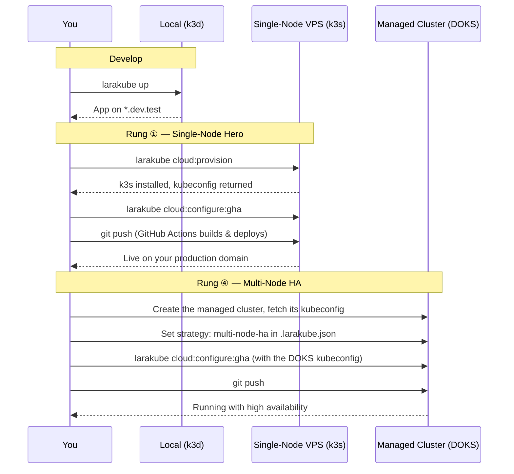

# 🪜 The Scaling Journey

The promise of LaraKube is simple: **start cheap, grow without rewrites.** The blueprint that runs your first $6 droplet is the same blueprint that runs a high-availability cluster later. To climb, you turn two dials:

- **Resilience** — how many machines: a single node (cheapest) → multiple nodes (survives a machine dying).
- **Density** — how you pack apps: one app per box → several apps side by side → several apps *sharing* one database and cache (the **Commons**) — a setup we call a **Plex**.

That's a 2 × 3 grid. Here's the whole journey, who each rung is for, and how you move between them.

| | **One app** | **Two+ apps, isolated** | **Plex — shared Commons** |
|---|---|---|---|
| **Single node** | ① Solopreneur's first launch | ② Startup with a couple of services | ③ Hobbyist on a shoestring |
| **Multiple nodes** | ④ A SaaS that can't go down | ⑤ Company with budget for isolation | ⑥ Agency keeping a fleet cheap |

> **What's shipping today:** rungs ①, ②, ④, and ⑤ are available now. The **Plex** rungs (③ and ⑥) — multiple apps *sharing* a Postgres/Redis "Commons" via `larakube plex` — are on the near-term [roadmap](../community/roadmap); the sections below describe where they're headed.

## 💸 What it costs — and what it doesn't

The monthly figures in each rung below are what you'd pay **your cloud provider** — the examples use **DigitalOcean (early 2026, approximate; prices change and vary by region and usage)**. A few things that are explicitly *not* a cost or a catch:

- **LaraKube is free and open source.** No subscription, no per-seat pricing, no usage fees, no paywalled "pro" tier — and no hidden fees. The CLI *is* the whole product.
- **You own everything.** It deploys to *your* cloud account, *your* servers, *your* data — you pay the provider directly. There's no LaraKube-hosted platform in the middle, and nothing to "migrate off" if you stop using it tomorrow.
- **It only generates files.** LaraKube writes standard Kubernetes manifests (kustomize) and Dockerfiles into your repo — that's it. **Nothing runs in your cluster on LaraKube's behalf, and nothing phones home.** The output is plain YAML and Docker you can read, audit, commit, and even `kubectl apply` *by hand* without the CLI. At runtime the only thing running is your own app, on infrastructure you control.

---

## ① Single node, single app — *the first launch*

**Meet Maya, a solopreneur.** She's built *Tallio*, a small invoicing SaaS, on nights and weekends. She doesn't have a DevOps team — she has a credit card and a deadline.

LaraKube puts Tallio on a **single $6–12/mo droplet**: her app, its Postgres, its Redis, HTTPS via Let's Encrypt, all from one `larakube` deploy. No Kubernetes expertise required.

```jsonc
"strategy": "single-node",
"environments": { "production": { "hosts": { "web": "tallio.app" } } }
```

**Rough cost:** ~$6–12/mo — a single droplet (1–2 GB), nothing else.

This is where ~90% of projects should start. → [The $6/mo Baseline](./6dollar-baseline) · [The Single-Node Hero](../architecture/single-node-hero)

## ② Single node, two apps — *a startup finds its shape*

**Meet Drift Labs, a two-person startup.** Their product is really *two* things: the customer app and a separate notifications/billing service (different repo, different release cadence). They don't want to pay for two servers yet.

Both apps deploy to the **same box, in separate namespaces**. Traefik routes each to its own domain by host header. Each keeps its own database — fully isolated, just co-located.

```text
one VPS
 ├─ drift-app-production       (drift.io)
 └─ drift-notify-production    (notify.drift.io)
```

**Rough cost:** still ~$12–24/mo — one 2 GB droplet sized for both apps. A second server would double the bill; co-locating them doesn't.

Great for microservices on a budget, or an app + its marketing site. → [Two Apps, One Server](./multiple-projects)

## ③ Single node, Plex — *the shoestring hobbyist*  🔜 *roadmap*

**Meet Sam, a serial side-projecter.** Sam has four small apps that barely get traffic. Paying for a database per app is absurd — but each one idling its own Postgres would blow past a 2GB box.

A **Plex** packs them onto one cheap node where they *share* a single Postgres and Redis (the **Commons**), each with its own isolated database and login — exactly like several apps sharing one managed database, but on a $12 box. Maximum density, minimum spend. One `larakube plex join` per app.

```text
one $12 VPS
 ├─ larakube-shared:  Postgres + Redis   (the Commons)
 ├─ app-a   ─┐
 ├─ app-b    ├─ each: own DB + login in the Commons
 └─ app-c   ─┘
```

**Rough cost:** ~$12/mo — one droplet for *several* apps, since they share a single Postgres + Redis instead of each running their own.

For the hobbyist whose constraint is *dollars*, not uptime. → [Roadmap](../community/roadmap)

## ④ Multiple nodes, single app — *a SaaS that can't go down*

**Maya, one year later.** Tallio has paying customers now, and an outage means refund emails. She graduates to a **managed, multi-node cluster** (DigitalOcean, Civo, Linode…). A node can die at 3am and her app stays up.

The move is a **dial, not a rewrite**: flip the strategy, point the database at a managed provider, redeploy. Same blueprint.

```jsonc
"environments": {
  "production": {
    "strategy": "multi-node-ha",
    "managed": ["postgres", "redis"]
  }
}
```

**Rough cost:** ~$50–90/mo — a 2-node managed cluster (DOKS) + a load balancer + a managed database. The jump from $12 is what "survives a node dying at 3am" costs.

This is the natural "we're a real business now" step. → [Strategy Switching](../architecture/strategy-switching) · [Deployment providers](./overview)

## ⑤ Multiple nodes, two apps — *a company that wants clean lines*

**Meet Northwind, an established MSME.** Two products, a team for each, and uptime expectations from customers. Budget isn't the tight constraint — *isolation and resilience* are.

Each product runs as its own app across a resilient multi-node cluster, in its own namespace, with its own managed database. Clean blast-radius boundaries: a bad deploy on one product can't touch the other.

This is rungs ② and ④ combined — independent apps, each highly available.

**Rough cost:** ~$90–160/mo — a larger node pool plus a managed database per product. You're paying for isolation and HA on purpose, not by accident.

## ⑥ Multiple nodes, Plex — *an agency keeping a fleet cheap*  🔜 *roadmap*

**Meet Atelier, a bootstrapped agency.** They host a dozen small client apps. Each client wants their site to stay up, but a dozen separate databases would wreck the margins.

A Plex on a **resilient cluster**: every client app shares a managed Commons (or a single managed database with per-tenant isolation), so they get multi-node uptime while paying for shared backing services once. When a client outgrows the shared tier, they **graduate** to their own managed database — a one-line host change, no migration.

**Rough cost:** ~$60–120/mo for the *whole fleet* — a resilient cluster + one shared managed database across many client apps. Per-app cost keeps dropping as you add tenants.

For agencies and platforms running many small tenants that still need to stay online. → [Roadmap](../community/roadmap)

---

## 🎚️ How you climb — without rewrites

The whole point: **moving between rungs is configuration, not a port.** Your application code never knows which rung it's on.

- **More resilience (down → right on the grid):** change `strategy` from `single-node` to `multi-node-ha`. LaraKube replicates your workloads and adjusts storage.
- **Offload a heavy service:** mark it `managed` and point at a provider endpoint. Your app just sees a connection string — whether that's an in-Plex Postgres, a DigitalOcean Managed Database, or RDS.
- **More density:** add a second repo to the same cluster (rung ②), or join a **Plex** to share the Commons (rung ③/⑥) with `larakube plex join`.

Because a service is "just a host" to your app, the scariest-sounding migration — *"move our database off the shared box"* — is a hostname change and a redeploy. That's the endgame LaraKube is built for: **pick the rung that fits your wallet and your risk today, and climb the moment you need to — never by rewriting, only by reconfiguring.**

## 🛠️ The same commands at every stage

Climbing barely changes your workflow — the commands are nearly identical from your laptop to a managed cluster. What changes is the blueprint's `strategy` and where the cluster lives.



Same app, same blueprint — you turned the resilience dial and pointed at a bigger cluster. No application code changes. (Note: a managed cluster like DOKS is created through your provider and its kubeconfig handed to LaraKube — `cloud:provision` is for standing up k3s on a plain VPS.)

→ Next: pin down every field on the blueprint in the [Blueprint Anatomy](../architecture/blueprint-anatomy).
