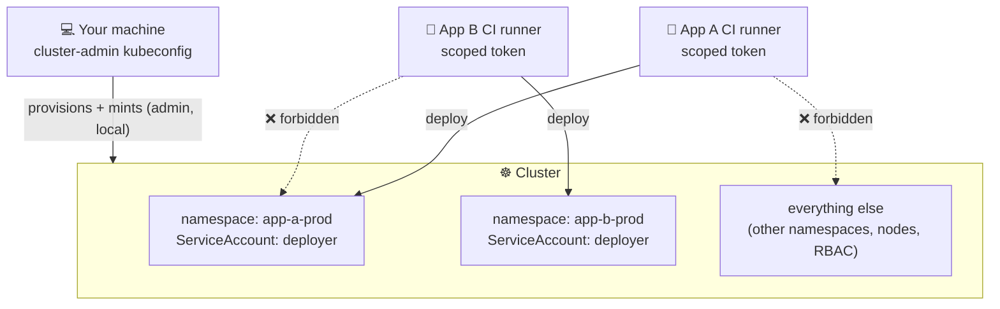

# 🛡️ Security Model

LaraKube is built so the credential most likely to leak — the one sitting in a CI secret or on a deploy runner — can do the **least possible damage**. Two ideas drive everything:

1. **Your admin credentials never leave your machine.**
2. **Everything automated runs with the narrowest privilege that still works.**



A leaked App A secret can deploy to **`app-a-prod` and nothing else** — not App B, not the shared Commons, not the node. Blast radius = one namespace.

## 1 · Admin stays local

The cluster-admin kubeconfig (from `cloud:provision`, or your provider's CLI for managed clusters) lives only in your `~/.kube/config`. LaraKube **never uploads it** to GitHub or any runner. It's the bootstrapping authority — used locally to *mint* the narrower credentials below — and it stays put.

## 2 · Namespace-scoped deploys

Both `larakube cloud:deploy` (manual) and the generated GitHub Actions workflow deploy as a per-app, per-environment **`deployer` ServiceAccount** locked to its own `{app}-{env}` namespace by a namespaced `Role`. A namespaced Role *can only* grant namespaced resources, so the token is forbidden everywhere else — by construction, not by policy.

```bash
# yes — inside its own namespace
kubectl auth can-i create deployments -n myapp-production \
  --as=system:serviceaccount:myapp-production:deployer        # → yes
# no — another namespace, or anything cluster-scoped
kubectl auth can-i get secrets -n default \
  --as=system:serviceaccount:myapp-production:deployer        # → no
```

The manual path **dogfoods** the exact same credential locally (admin only bootstraps it, then the apply runs as `deployer`), so a missing permission surfaces on your machine — where you hold admin to fix it — rather than in CI. Full detail: [Surgical Credentials](../deployment/surgical-credentials).

## 3 · A hardened server

For self-managed VPS nodes, `cloud:provision` doesn't just install k3s — it **locks the box down**: a default-deny firewall, fail2ban, automatic security updates, key-only SSH, and (guarded) disabling of remote root login. `cloud:harden` re-applies it to an existing server. See [Server Hardening](./server-hardening).

*(Managed clusters — DOKS/EKS/GKE/AKS — are hardened at the node level by your provider; LaraKube targets them by kube-context and never SSHes in.)*

## 4 · Multi-app isolation

Several apps can share one cluster (and even one set of backing services via [Plex](../deployment/multiple-projects)) while staying isolated:

- **Namespaces** — each app/env is its own namespace; the scoped `deployer` can't cross them.
- **Plex tenants** — on a shared Commons, each app gets its **own** database + login, Redis logical DB, and S3 bucket. A tenant credential reaches its own data and no one else's.

## What isn't covered yet (honest)

Security is layered, and a few hardening knobs are deliberately deferred (tracked in the CLI's `plans/active/server-hardening.md`):

- The **k3s API (6443)** is open to the internet by default — restricting it to your operator IP is a recommended manual follow-up.
- The **`larakube` admin user keeps full sudo** (it's the box's admin once root login is off) — OS-level deploy isolation, if ever wanted, would be a separate dedicated user.
- **Real SSO (OIDC)** for human access is a longer-term path; today, [Team Access](../teams/overview) issues per-person, revocable, scoped kubeconfigs (in-cluster credentials rather than federated identities).

LaraKube's goal isn't to claim perfection — it's to make the **secure path the default one**, and to be honest about the edges.
